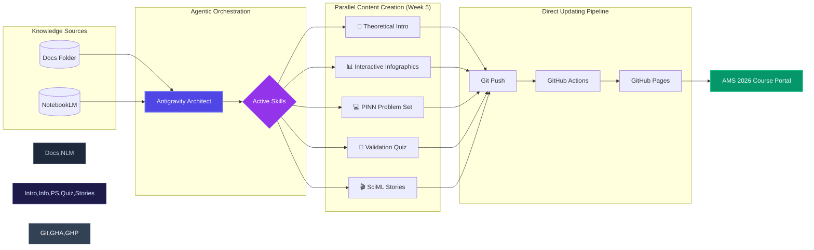

# Implementation Plan - Standardizing Headers & Fixing Week 14

Standardize the "Theoretical Introduction" headers across all weeks to a premium design and address the reported "W15" confusion and encoding issues.

## User Review Required

> [!IMPORTANT]
> The "Intro Banner" in each week's introduction will be replaced with a premium header layout. The introductory text will be preserved in a "glass-card" below the new header.

## Proposed Changes

### Global Styling & Translations

#### [MODIFY] [data.js](file:///c:/Users/SvetlanaMeissner/Documents/ddoc/06_Cottbus/AI/Webseiten/ams-course-2026/assets/js/data.js)
- Double-check all occurrences of "Materialien öffnen" and ensure they are "Materialien Öffnen".
- Verify Week 14 data to ensure no "15" is leaking.

**Workflow Overview:**
1. **Knowledge Ingestion**: Data is pulled from the local **Docs Folder** and synthesized via **NotebookLM**.
2. **Agentic Orchestration**: The **Antigravity Architect** activates specialized skills (ML Best Practices, Academic Research, JAX/Flax) to ensure technical rigor.
3. **Content Production**: Five parallel workstreams generate the module's core components: Theory, Infographics, Problem Sets, Quizzes, and Stories.
4. **Automated Pipeline**: Every update triggers a direct pipeline from **Git Push** through **GitHub Actions** to the live **GitHub Pages** portal.

### Introduction Headers (All Weeks)

#### [MODIFY] `weeks/week*/introduction.html` and `introduction_en.html`
- Replace existing Intro Banners/Headers with the new premium design:
    - **Header Block**: A large, bold title "Theoretische Einführung" (DE) or "Theoretical Introduction" (EN) with a gradient accent bar and a mono-spaced label.
    - **Intro Text**: The existing description text will be moved into a sleek, semi-transparent card immediately following the header.

### Week 14 Specific Fixes

#### [MODIFY] [introduction.html](file:///c:/Users/SvetlanaMeissner/Documents/ddoc/06_Cottbus/AI/Webseiten/ams-course-2026/weeks/week14/introduction.html)
- Ensure the header says "Theoretische Einführung" as requested, but keep the "Showcase" context in the sub-label or description.
- Check for any accidental "W15" strings in the content.

## Verification Plan

### Automated Tests
- Run `check_quizzes_v2.py` to ensure no regressions in quiz structure.
- Run a grep for "Theoretische Einführung" to ensure it's applied everywhere.

### Manual Verification
- Open the main page and verify the "Materialien Öffnen" button text.
- Navigate through multiple weeks to verify the new premium header design.
- Specifically check Week 14 to ensure it displays "W14" and has the correct header.
